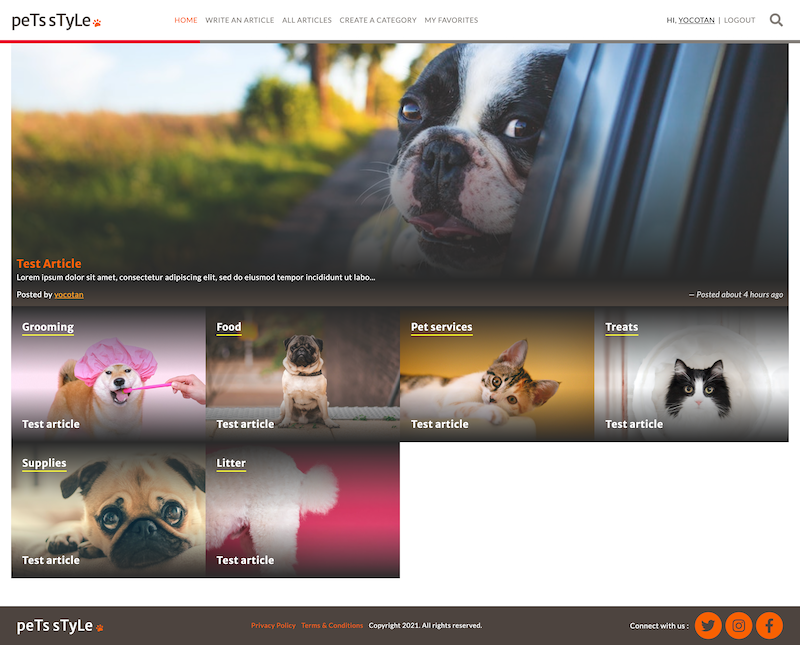
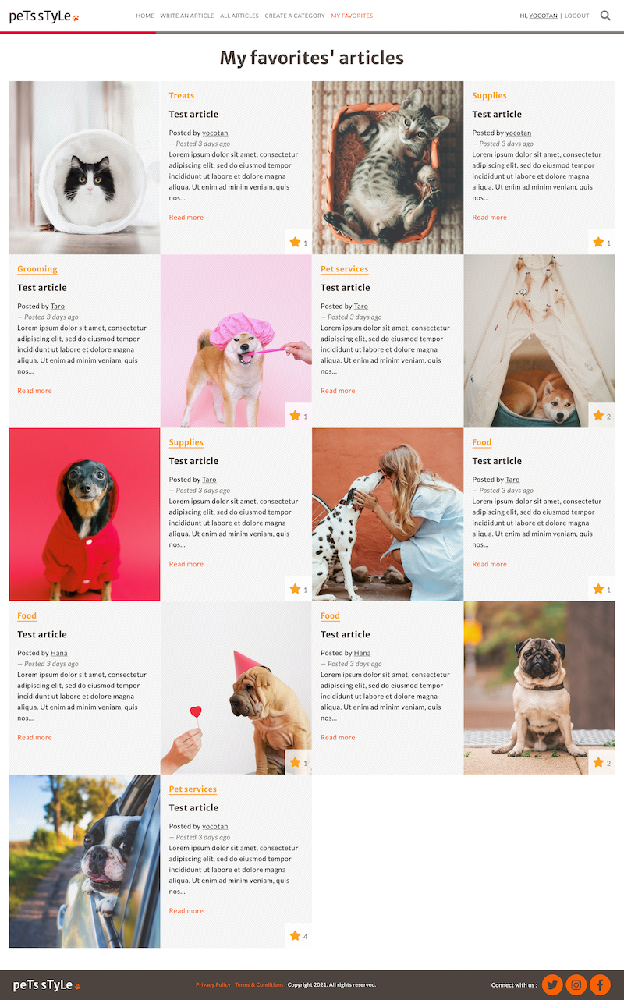

# Pets Mag

## About the Project

This project is based on the lifestyle articles website. 
Instead of the Lifestyle topic, I personalized it having the content of pets.

This web app includes the following features:

- The user logs in to the app, only by typing the username 
- The user is presented with the homepage that includes
  * Featured article with full-width image and title in the first row. This is an article with the biggest number of votes
  * List of all categories in order of priority. Each category is displayed as a square with its name on the top and its most recent article's title at the bottom. The background image is the image of the most recent article in this category
- When the user clicks the category name, they can see all articles in that category
  * Articles are sorted by most recent
  * Each article displays: image, title, truncated text as preview and its author-name
  * Add Star button to vote for article (each user can vote only once)
- Each page uses the same top menu and footer:
  * Top menu includes links to pages that are implemented: Home and Write an article
- When the user opens "Write an article" page:
  * A form with all necessary fields is displayed

Plus, I added some features that are not required:
- All articles view which is showing all articles
- Create a category form that logged in user can create a new category
- My favorites view that shows all articles that the current user voted
- User's page view that shows all articles that each user posted and in the case of the current user, it shows the account setting buttons including edit and delete user
- Applying Responsive Design for all pages so that users can see this website on mobile and tablet.

I followed the guidelines of ["liFEsTlye."](https://www.behance.net/gallery/14554909/liFEsTlye-Mobile-version) design, including:

- colors
- typographies: font face, size, and weight
- layout: composition and space between elements

Also, I followed guidelines as below:
- Database schema reflects [the given structure](./docs/ERD__articles.png)
- Validate all user input to make sure that none with bad intentions can destroy the app
- Use Postgres as a database
- MVP of the full product (with the full graphical design but only basic features that can be easily extended in the future)

The video description for this project is [here](https://youtu.be/BkQgvo3dxWE).

A list of commonly used resources that I find helpful is listed in the acknowledgments.

## Table of Contents

* [About the Project](#about-the-project)
* [Built With](#built-with)
* [Live Demo](#live-demo)
* [Getting Started](#getting-started)
* [Author](#author)
* [Contributing](#contributing)
* [Show your support](#show-your-support)
* [License](#license)
* [Acknowledgements](#acknowledgements)

## Built With

* [Ruby on Rails](https://rubyonrails.org/)
* [Ruby](https://www.ruby-lang.org/en/)
* [HTML5](https://en.wikipedia.org/wiki/HTML5)
* [SASS(SCSS)](https://sass-lang.com/)
* [JavaScript](https://en.wikipedia.org/wiki/JavaScript)

## Live Demo

[Live Demo Link](https://mv-pets-mag.herokuapp.com/)

## Getting Started

To get a local copy up and running follow these simple example steps.

1. On the project GitHub page, navigate to the main page of the repository.
2. Under the repository name, locate and click on a green button named `Code`. 
3. Copy the project URL as displayed.
4. If you're running the Windows Operating System, open your command prompt. On Linux, Open your terminal. 
5. Change the current working directory to the location where you want the cloned directory to be made. Leave as it is if the current location is where you want the project to be. 
6. Type git clone, and then paste the URL you copied in Step 3.  
e.g. $ git clone https://github.com/yourUsername/yourProjectName 
7. Press Enter. Your local copy will be created. 
8. To install all dependencies and necessary gems, run `bundle installl`, `yarn install`
9. Run `rails db:create`, then `rails db:migarate` * Remember to create table before migration
10. Run `rails server` to run rails application in your local server
11. Run `rspec` to run rspec tests

## Author

👤 **Yoko Saka**

- GitHub: [@yocosaka](https://github.com/yocosaka)
- Twitter: [@yocosaka](https://twitter.com/yocosaka)
- LinkedIn: [Yoko Saka](https://www.linkedin.com/in/yokosaka)

## Contributing

Contributions, issues, and feature requests are welcome!
Feel free to check the [issues page](../../issues).

1. Fork the Project
2. Create your Feature Branch (`git checkout -b feature/AmazingFeature`)
3. Commit your Changes (`git commit -m 'Add some AmazingFeature'`)
4. Push to the Branch (`git push origin feature/AmazingFeature`)
5. Open a Pull Request

## Show your support

Give a ⭐️ if you like this project!

## License

["liFEsTlye."](https://www.behance.net/gallery/14554909/liFEsTlye-Mobile-version) design idea by [Nelson Sakwa on Behance](https://www.behance.net/sakwadesignstudio) is licensed under [Creative Commons license of the design](https://creativecommons.org/licenses/by-nc/4.0/).

## Acknowledgements
* [paper clip](https://github.com/thoughtbot/paperclip)
* [normalize-rails](https://github.com/markmcconachie/normalize-rails)
* [font-awesome-sass](https://github.com/FortAwesome/font-awesome-sass)
* [rspec-rails](https://github.com/rspec/rspec-rails)
* [shoulda-matchers](https://github.com/thoughtbot/shoulda-matchers)
* [Pexels](https://www.pexels.com/)
